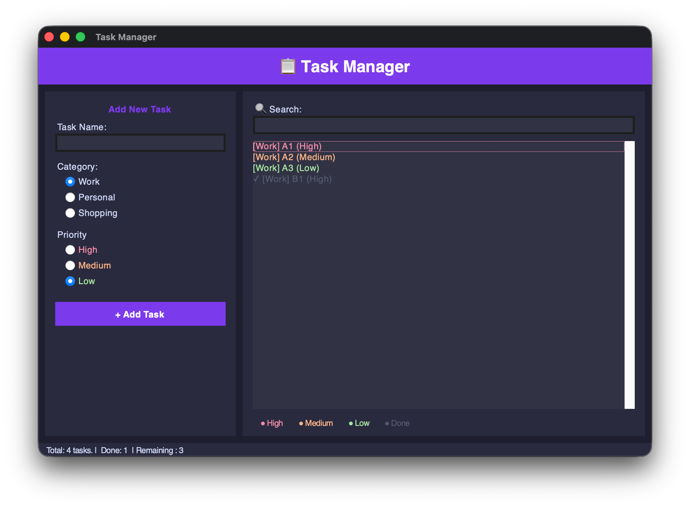

# 📋 Task Manager App

A clean, dark-themed desktop task manager built with Python and Tkinter — no external dependencies required.


## ✨ Features

- **Add tasks** with name, category, and priority level
- **Priority color coding** — High (red), Medium (orange), Low (green)
- **Categories** — Work, Personal, Shopping
- **Mark tasks as done** (double-click or Space)
- **Delete tasks** with confirmation
- **Live search** — filter tasks as you type
- **Save & Load** — persist tasks as JSON files
- **Keyboard shortcuts** — Cmd+N, Cmd+O, Cmd+S, Delete, Space
- **Dark UI** — Catppuccin-inspired color scheme

## 📖 How to Use

1. **Add a task** — type a name in the left panel, pick a category and priority, then click **+ Add Task**
2. **Mark as done** — select a task and press `Space`, or double-click it — it turns grey
3. **Delete a task** — select it and press `Delete` (a confirmation dialog appears)
4. **Search** — start typing in the search bar; the list filters live as you type
5. **Save your tasks** — use `Cmd+S` / `Ctrl+S` or File → Save to export as a `.json` file
6. **Load tasks** — use `Cmd+O` / `Ctrl+O` or File → Open to reload a previously saved file
7. **New session** — use `Cmd+N` / `Ctrl+N` or File → New to clear all tasks and start fresh

> **Keyboard shortcuts** auto-adapt: `Cmd` on macOS, `Ctrl` on Windows/Linux.

## 🖥️ Screenshots

| Empty state | With tasks |
|-------------|-----------|
|  |  |

## 🚀 Getting Started

### Prerequisites

- Python 3.8 or higher
- Tkinter (included with most Python installations)

### Run

```bash
python TaskManagerApp.py
```

> **Note for Linux users:** If Tkinter is not installed, run:
> ```bash
> sudo apt-get install python3-tk
> ```

## ⌨️ Keyboard Shortcuts

| Shortcut | Action |
|----------|--------|
| `Cmd+N` / `Ctrl+N` | New file |
| `Cmd+O` / `Ctrl+O` | Open tasks |
| `Cmd+S` / `Ctrl+S` | Save tasks |
| `Delete` | Delete selected task |
| `Space` | Toggle task complete |
| `Double-click` | Toggle task complete |

## 📁 File Format

Tasks are saved as `.json` files:

```json
[
  {
    "name": "Buy groceries",
    "category": "Shopping",
    "priority": "Low",
    "done": false
  }
]
```

## 🛠️ Built With

- [Python](https://www.python.org/) — core language
- [Tkinter](https://docs.python.org/3/library/tkinter.html) — GUI framework (stdlib)
- `json`, `os` — file handling (stdlib)

## 📄 License

MIT License — feel free to use, modify, and share.
